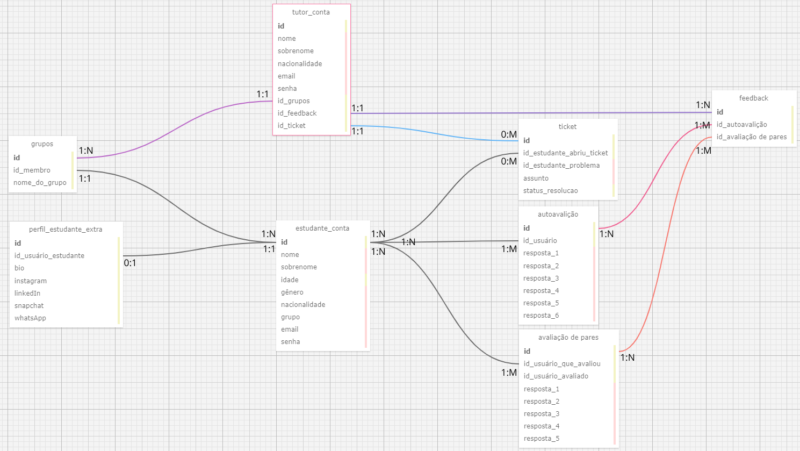

# Modelo de Banco de Dados Relacional

<div align="center">
<sub>Figura 1 - Modelo de banco de dados</sub>

<sup>Fonte: Material produzido pelos autores (2024)</sup>
</div>

## Descrição
- Nome do Projeto: WebCulture
- Descrição: Criação de um banco de dados relacional que indica as entidades, seus atributos e relações dentro do site que será desenvolvido para a ZUYD
- Ferramenta de diagramação: SQL Designer

## Explicação das telas e entidades
Na tela de cadastro serão coletados dados pessoais, como nome, nacionalidade, email, senha, etc. Dependendo do tipo de conta (estudande ou tutor), os dados irão para a entidade estudante_conta ou tutor_conta. O estudante terá a oportunidade de adicionar informações extras posteriormente ao seu cadastro, as quais ficarão armazenadas na entidade perfil_estudante_extra.


## Relações de cardinalidade

### 1. estudante_conta (1:1) e perfil_estudante_conta (0:1)
Para cada conta de estudante criada há nenhuma ou uma área que o usuário pode preencher informações extras sobre seu perfil.

### 2. estudante_conta (1:N) e grupos (1:1)
Para um, e somente um, grupo há um ou muitos estudantes. Mas cada estudante só pertence a um grupo.

### 3. estudante_conta (1:N) e ticket (0:M)
Um ou muitos estudantes podem ter nenhum ou vários tickets em que são mencionados. 

### 4. estudante_conta (1:N) e autoavaliação (1:M)
Um ou muitos estudantes podem realizar uma ou muitas autoavaliações. Muitas ou uma autoavaliação podem ter sido realizadas por um ou muitos alunos.

### 5. estudante_conta (1:N) e avaliação de pares (1:M)
Um ou muitos estudantes podem realizar uma ou muitas avaliações de pares. Muitas ou uma avaliação de pares podem ter sido realizadas por um ou muitos alunos.

### 6. autoavaliação (1:N) e feedback (1:M)
Uma ou muitas autoavaliações resultam em um ou vários feedbacks.

### 7. avaliação de pares (1:N) e feedback (1:M)
Uma ou muitas avaliações de pares resultam em um ou vários feedbacks.

### 8. conta_tutor (1:1) e feedback (1:N)
Um, e somente um, tutor pode acessar um ou vários feedbacks. Todos os feedbacks só podem ser vizualizados por um único tutor.

### 9. conta_tutor (1:1) e tickets (1:N)
Um e apenas um tutor pode ser acesso há um ou muitos tickets. 

### 10. tutor_conta (1:1) e grupos (1:N)
Um e apenas um tutor pode ser responsável por um ou muitos grupos. Assim, todos os grupos tem apenas um tutor.


## Banco em XML
```
<?xml version="1.0" encoding="utf-8" ?>
<!-- SQL XML created by WWW SQL Designer, https://github.com/ondras/wwwsqldesigner/ -->
<!-- Active URL: https://sql.toad.cz/ -->
<sql>
<datatypes db="mysql">
	<group label="Numeric" color="rgb(238,238,170)">
		<type label="Integer" length="0" sql="INTEGER" quote=""/>
	 	<type label="TINYINT" length="0" sql="TINYINT" quote=""/>
	 	<type label="SMALLINT" length="0" sql="SMALLINT" quote=""/>
	 	<type label="MEDIUMINT" length="0" sql="MEDIUMINT" quote=""/>
	 	<type label="INT" length="0" sql="INT" quote=""/>
		<type label="BIGINT" length="0" sql="BIGINT" quote=""/>
		<type label="Decimal" length="1" sql="DECIMAL" re="DEC" quote=""/>
		<type label="Single precision" length="0" sql="FLOAT" quote=""/>
		<type label="Double precision" length="0" sql="DOUBLE" re="DOUBLE" quote=""/>
	</group>

	<group label="Character" color="rgb(255,200,200)">
		<type label="Char" length="1" sql="CHAR" quote="'"/>
		<type label="Varchar" length="1" sql="VARCHAR" quote="'"/>
		<type label="Text" length="0" sql="MEDIUMTEXT" re="TEXT" quote="'"/>
		<type label="Binary" length="1" sql="BINARY" quote="'"/>
		<type label="Varbinary" length="1" sql="VARBINARY" quote="'"/>
		<type label="BLOB" length="0" sql="BLOB" re="BLOB" quote="'"/>
	</group>

	<group label="Date &amp; Time" color="rgb(200,255,200)">
		<type label="Date" length="0" sql="DATE" quote="'"/>
		<type label="Time" length="0" sql="TIME" quote="'"/>
		<type label="Datetime" length="0" sql="DATETIME" quote="'"/>
		<type label="Year" length="0" sql="YEAR" quote=""/>
		<type label="Timestamp" length="0" sql="TIMESTAMP" quote="'"/>
	</group>
	
	<group label="Miscellaneous" color="rgb(200,200,255)">
		<type label="ENUM" length="1" sql="ENUM" quote=""/>
		<type label="SET" length="1" sql="SET" quote=""/>
		<type label="Bit" length="0" sql="bit" quote=""/>
	</group>
</datatypes><table x="700" y="749" name="estudante_conta">
<row name="id" null="1" autoincrement="1">
<datatype>INTEGER</datatype>
<default>NULL</default></row>
<row name="nome" null="1" autoincrement="0">
<datatype>VARCHAR</datatype>
<default>NULL</default></row>
<row name="sobrenome" null="1" autoincrement="0">
<datatype>VARCHAR</datatype>
<default>NULL</default></row>
<row name="idade" null="1" autoincrement="0">
<datatype>INTEGER</datatype>
<default>NULL</default></row>
<row name="gênero" null="1" autoincrement="0">
<datatype>VARCHAR</datatype>
<default>NULL</default></row>
<row name="nacionalidade" null="1" autoincrement="0">
<datatype>VARCHAR</datatype>
<default>NULL</default></row>
<row name="grupo" null="1" autoincrement="0">
<datatype>VARCHAR</datatype>
<default>NULL</default></row>
<row name="email" null="1" autoincrement="0">
<datatype>VARCHAR</datatype>
<default>NULL</default></row>
<row name="senha" null="1" autoincrement="0">
<datatype>VARCHAR</datatype>
<default>NULL</default></row>
<key type="PRIMARY" name="">
<part>id</part>
</key>
</table>
<table x="1151" y="723" name="autoavalição">
<row name="id" null="1" autoincrement="1">
<datatype>INTEGER</datatype>
<default>NULL</default></row>
<row name="id_usuário" null="1" autoincrement="0">
<datatype>INTEGER</datatype>
<default>NULL</default><relation table="estudante_conta" row="id" />
</row>
<row name="resposta_1" null="1" autoincrement="0">
<datatype>CHAR</datatype>
<default>NULL</default></row>
<row name="resposta_2" null="1" autoincrement="0">
<datatype>CHAR</datatype>
<default>NULL</default></row>
<row name="resposta_3" null="1" autoincrement="0">
<datatype>CHAR</datatype>
<default>NULL</default></row>
<row name="resposta_4" null="1" autoincrement="0">
<datatype>CHAR</datatype>
<default>NULL</default></row>
<row name="resposta_5" null="1" autoincrement="0">
<datatype>CHAR</datatype>
<default>NULL</default></row>
<row name="resposta_6" null="1" autoincrement="0">
<datatype>VARCHAR</datatype>
<default>NULL</default></row>
<key type="PRIMARY" name="">
<part>id</part>
</key>
</table>
<table x="1152" y="952" name="avaliação de pares">
<row name="id" null="1" autoincrement="1">
<datatype>INTEGER</datatype>
<default>NULL</default></row>
<row name="id_usuário_que_avaliou" null="1" autoincrement="0">
<datatype>INTEGER</datatype>
<default>NULL</default><relation table="estudante_conta" row="id" />
</row>
<row name="id_usuário_avaliado" null="1" autoincrement="0">
<datatype>INTEGER</datatype>
<default>NULL</default></row>
<row name="resposta_1" null="1" autoincrement="0">
<datatype>CHAR</datatype>
<default>NULL</default></row>
<row name="resposta_2" null="1" autoincrement="0">
<datatype>CHAR</datatype>
<default>NULL</default></row>
<row name="resposta_3" null="1" autoincrement="0">
<datatype>CHAR</datatype>
<default>NULL</default></row>
<row name="resposta_4" null="1" autoincrement="0">
<datatype>CHAR</datatype>
<default>NULL</default></row>
<row name="resposta_5" null="1" autoincrement="0">
<datatype>CHAR</datatype>
<default>NULL</default></row>
<key type="PRIMARY" name="">
<part>id</part>
</key>
</table>
<table x="202" y="592" name="grupos">
<row name="id" null="1" autoincrement="1">
<datatype>INTEGER</datatype>
<default>NULL</default></row>
<row name="id_membro" null="1" autoincrement="0">
<datatype>INTEGER</datatype>
<default>NULL</default><relation table="estudante_conta" row="id" />
</row>
<row name="nome_do_grupo" null="1" autoincrement="0">
<datatype>INTEGER</datatype>
<default>NULL</default></row>
<key type="PRIMARY" name="">
<part>id</part>
</key>
</table>
<table x="1511" y="507" name="feedback">
<row name="id" null="1" autoincrement="1">
<datatype>INTEGER</datatype>
<default>NULL</default></row>
<row name="id_autoavalição" null="1" autoincrement="0">
<datatype>INTEGER</datatype>
<default>NULL</default><relation table="autoavalição" row="id" />
</row>
<row name="id_avaliação de pares" null="1" autoincrement="0">
<datatype>INTEGER</datatype>
<default>NULL</default><relation table="avaliação de pares" row="id" />
</row>
<key type="PRIMARY" name="">
<part>id</part>
</key>
</table>
<table x="204" y="751" name="perfil_estudante_extra">
<row name="id" null="1" autoincrement="1">
<datatype>INTEGER</datatype>
<default>NULL</default></row>
<row name="id_usuário_estudante" null="1" autoincrement="0">
<datatype>INTEGER</datatype>
<default>NULL</default><relation table="estudante_conta" row="id" />
</row>
<row name="bio" null="1" autoincrement="0">
<datatype>INTEGER</datatype>
<default>NULL</default></row>
<row name="instagram" null="1" autoincrement="0">
<datatype>INTEGER</datatype>
<default>NULL</default></row>
<row name="linkedIn" null="1" autoincrement="0">
<datatype>INTEGER</datatype>
<default>NULL</default></row>
<row name="snapchat" null="1" autoincrement="0">
<datatype>INTEGER</datatype>
<default>NULL</default></row>
<row name="whatsApp" null="1" autoincrement="0">
<datatype>INTEGER</datatype>
<default>NULL</default></row>
<key type="PRIMARY" name="">
<part>id</part>
</key>
</table>
<table x="694" y="347" name="tutor_conta">
<row name="id" null="1" autoincrement="1">
<datatype>INTEGER</datatype>
<default>NULL</default></row>
<row name="nome" null="1" autoincrement="0">
<datatype>VARCHAR</datatype>
<default>NULL</default></row>
<row name="sobrenome" null="1" autoincrement="0">
<datatype>VARCHAR</datatype>
<default>NULL</default></row>
<row name="nacionalidade" null="1" autoincrement="0">
<datatype>VARCHAR</datatype>
<default>NULL</default></row>
<row name="email" null="1" autoincrement="0">
<datatype>VARCHAR</datatype>
<default>NULL</default></row>
<row name="senha" null="1" autoincrement="0">
<datatype>VARCHAR</datatype>
<default>NULL</default></row>
<row name="id_grupos" null="1" autoincrement="0">
<datatype>INTEGER</datatype>
<default>NULL</default><relation table="grupos" row="id" />
</row>
<row name="id_feedback" null="1" autoincrement="0">
<datatype>INTEGER</datatype>
<default>NULL</default><relation table="feedback" row="id" />
</row>
<row name="id_ticket" null="1" autoincrement="0">
<datatype>INTEGER</datatype>
<default>NULL</default><relation table="ticket" row="id" />
</row>
<key type="PRIMARY" name="">
<part>id</part>
</key>
</table>
<table x="1151" y="560" name="ticket">
<row name="id" null="1" autoincrement="1">
<datatype>INTEGER</datatype>
<default>NULL</default></row>
<row name="id_estudante_abriu_ticket" null="1" autoincrement="0">
<datatype>INTEGER</datatype>
<default>NULL</default><relation table="estudante_conta" row="id" />
</row>
<row name="id_estudante_problema" null="1" autoincrement="0">
<datatype>VARCHAR</datatype>
<default>NULL</default></row>
<row name="assunto" null="1" autoincrement="0">
<datatype>VARCHAR</datatype>
<default>NULL</default></row>
<row name="status_resolucao" null="1" autoincrement="0">
<datatype>INTEGER</datatype>
<default>NULL</default></row>
<key type="PRIMARY" name="">
<part>id</part>
</key>
</table>
</sql>

```

## Banco em MySQL

```
-- ---
-- Globals
-- ---

-- SET SQL_MODE="NO_AUTO_VALUE_ON_ZERO";
-- SET FOREIGN_KEY_CHECKS=0;

-- ---
-- Table 'estudante_conta'
-- 
-- ---

DROP TABLE IF EXISTS `estudante_conta`;
		
CREATE TABLE `estudante_conta` (
  `id` INTEGER NULL AUTO_INCREMENT DEFAULT NULL,
  `nome` VARCHAR NULL DEFAULT NULL,
  `sobrenome` VARCHAR NULL DEFAULT NULL,
  `idade` INTEGER NULL DEFAULT NULL,
  `gênero` VARCHAR NULL DEFAULT NULL,
  `nacionalidade` VARCHAR NULL DEFAULT NULL,
  `grupo` VARCHAR NULL DEFAULT NULL,
  `email` VARCHAR NULL DEFAULT NULL,
  `senha` VARCHAR NULL DEFAULT NULL,
  PRIMARY KEY (`id`)
);

-- ---
-- Table 'autoavalição'
-- 
-- ---

DROP TABLE IF EXISTS `autoavalição`;
		
CREATE TABLE `autoavalição` (
  `id` INTEGER NULL AUTO_INCREMENT DEFAULT NULL,
  `id_usuário` INTEGER NULL DEFAULT NULL,
  `resposta_1` CHAR NULL DEFAULT NULL,
  `resposta_2` CHAR NULL DEFAULT NULL,
  `resposta_3` CHAR NULL DEFAULT NULL,
  `resposta_4` CHAR NULL DEFAULT NULL,
  `resposta_5` CHAR NULL DEFAULT NULL,
  `resposta_6` VARCHAR NULL DEFAULT NULL,
  PRIMARY KEY (`id`)
);

-- ---
-- Table 'avaliação de pares'
-- 
-- ---

DROP TABLE IF EXISTS `avaliação de pares`;
		
CREATE TABLE `avaliação de pares` (
  `id` INTEGER NULL AUTO_INCREMENT DEFAULT NULL,
  `id_usuário_que_avaliou` INTEGER NULL DEFAULT NULL,
  `id_usuário_avaliado` INTEGER NULL DEFAULT NULL,
  `resposta_1` CHAR NULL DEFAULT NULL,
  `resposta_2` CHAR NULL DEFAULT NULL,
  `resposta_3` CHAR NULL DEFAULT NULL,
  `resposta_4` CHAR NULL DEFAULT NULL,
  `resposta_5` CHAR NULL DEFAULT NULL,
  PRIMARY KEY (`id`)
);

-- ---
-- Table 'grupos'
-- 
-- ---

DROP TABLE IF EXISTS `grupos`;
		
CREATE TABLE `grupos` (
  `id` INTEGER NULL AUTO_INCREMENT DEFAULT NULL,
  `id_membro` INTEGER NULL DEFAULT NULL,
  `nome_do_grupo` INTEGER NULL DEFAULT NULL,
  PRIMARY KEY (`id`)
);

-- ---
-- Table 'feedback'
-- 
-- ---

DROP TABLE IF EXISTS `feedback`;
		
CREATE TABLE `feedback` (
  `id` INTEGER NULL AUTO_INCREMENT DEFAULT NULL,
  `id_autoavalição` INTEGER NULL DEFAULT NULL,
  `id_avaliação de pares` INTEGER NULL DEFAULT NULL,
  PRIMARY KEY (`id`)
);

-- ---
-- Table 'perfil_estudante_extra'
-- 
-- ---

DROP TABLE IF EXISTS `perfil_estudante_extra`;
		
CREATE TABLE `perfil_estudante_extra` (
  `id` INTEGER NULL AUTO_INCREMENT DEFAULT NULL,
  `id_usuário_estudante` INTEGER NULL DEFAULT NULL,
  `bio` INTEGER NULL DEFAULT NULL,
  `instagram` INTEGER NULL DEFAULT NULL,
  `linkedIn` INTEGER NULL DEFAULT NULL,
  `snapchat` INTEGER NULL DEFAULT NULL,
  `whatsApp` INTEGER NULL DEFAULT NULL,
  PRIMARY KEY (`id`)
);

-- ---
-- Table 'tutor_conta'
-- 
-- ---

DROP TABLE IF EXISTS `tutor_conta`;
		
CREATE TABLE `tutor_conta` (
  `id` INTEGER NULL AUTO_INCREMENT DEFAULT NULL,
  `nome` VARCHAR NULL DEFAULT NULL,
  `sobrenome` VARCHAR NULL DEFAULT NULL,
  `nacionalidade` VARCHAR NULL DEFAULT NULL,
  `email` VARCHAR NULL DEFAULT NULL,
  `senha` VARCHAR NULL DEFAULT NULL,
  `id_grupos` INTEGER NULL DEFAULT NULL,
  `id_feedback` INTEGER NULL DEFAULT NULL,
  `id_ticket` INTEGER NULL DEFAULT NULL,
  PRIMARY KEY (`id`)
);

-- ---
-- Table 'ticket'
-- 
-- ---

DROP TABLE IF EXISTS `ticket`;
		
CREATE TABLE `ticket` (
  `id` INTEGER NULL AUTO_INCREMENT DEFAULT NULL,
  `id_estudante_abriu_ticket` INTEGER NULL DEFAULT NULL,
  `id_estudante_problema` VARCHAR NULL DEFAULT NULL,
  `assunto` VARCHAR NULL DEFAULT NULL,
  `status_resolucao` INTEGER NULL DEFAULT NULL,
  PRIMARY KEY (`id`)
);

-- ---
-- Foreign Keys 
-- ---

ALTER TABLE `autoavalição` ADD FOREIGN KEY (id_usuário) REFERENCES `estudante_conta` (`id`);
ALTER TABLE `avaliação de pares` ADD FOREIGN KEY (id_usuário_que_avaliou) REFERENCES `estudante_conta` (`id`);
ALTER TABLE `grupos` ADD FOREIGN KEY (id_membro) REFERENCES `estudante_conta` (`id`);
ALTER TABLE `feedback` ADD FOREIGN KEY (id_autoavalição) REFERENCES `autoavalição` (`id`);
ALTER TABLE `feedback` ADD FOREIGN KEY (id_avaliação de pares) REFERENCES `avaliação de pares` (`id`);
ALTER TABLE `perfil_estudante_extra` ADD FOREIGN KEY (id_usuário_estudante) REFERENCES `estudante_conta` (`id`);
ALTER TABLE `tutor_conta` ADD FOREIGN KEY (id_grupos) REFERENCES `grupos` (`id`);
ALTER TABLE `tutor_conta` ADD FOREIGN KEY (id_feedback) REFERENCES `feedback` (`id`);
ALTER TABLE `tutor_conta` ADD FOREIGN KEY (id_ticket) REFERENCES `ticket` (`id`);
ALTER TABLE `ticket` ADD FOREIGN KEY (id_estudante_abriu_ticket) REFERENCES `estudante_conta` (`id`);

-- ---
-- Table Properties
-- ---

-- ALTER TABLE `estudante_conta` ENGINE=InnoDB DEFAULT CHARSET=utf8 COLLATE=utf8_bin;
-- ALTER TABLE `autoavalição` ENGINE=InnoDB DEFAULT CHARSET=utf8 COLLATE=utf8_bin;
-- ALTER TABLE `avaliação de pares` ENGINE=InnoDB DEFAULT CHARSET=utf8 COLLATE=utf8_bin;
-- ALTER TABLE `grupos` ENGINE=InnoDB DEFAULT CHARSET=utf8 COLLATE=utf8_bin;
-- ALTER TABLE `feedback` ENGINE=InnoDB DEFAULT CHARSET=utf8 COLLATE=utf8_bin;
-- ALTER TABLE `perfil_estudante_extra` ENGINE=InnoDB DEFAULT CHARSET=utf8 COLLATE=utf8_bin;
-- ALTER TABLE `tutor_conta` ENGINE=InnoDB DEFAULT CHARSET=utf8 COLLATE=utf8_bin;
-- ALTER TABLE `ticket` ENGINE=InnoDB DEFAULT CHARSET=utf8 COLLATE=utf8_bin;

-- ---
-- Test Data
-- ---

-- INSERT INTO `estudante_conta` (`id`,`nome`,`sobrenome`,`idade`,`gênero`,`nacionalidade`,`grupo`,`email`,`senha`) VALUES
-- ('','','','','','','','','');
-- INSERT INTO `autoavalição` (`id`,`id_usuário`,`resposta_1`,`resposta_2`,`resposta_3`,`resposta_4`,`resposta_5`,`resposta_6`) VALUES
-- ('','','','','','','','');
-- INSERT INTO `avaliação de pares` (`id`,`id_usuário_que_avaliou`,`id_usuário_avaliado`,`resposta_1`,`resposta_2`,`resposta_3`,`resposta_4`,`resposta_5`) VALUES
-- ('','','','','','','','');
-- INSERT INTO `grupos` (`id`,`id_membro`,`nome_do_grupo`) VALUES
-- ('','','');
-- INSERT INTO `feedback` (`id`,`id_autoavalição`,`id_avaliação de pares`) VALUES
-- ('','','');
-- INSERT INTO `perfil_estudante_extra` (`id`,`id_usuário_estudante`,`bio`,`instagram`,`linkedIn`,`snapchat`,`whatsApp`) VALUES
-- ('','','','','','','');
-- INSERT INTO `tutor_conta` (`id`,`nome`,`sobrenome`,`nacionalidade`,`email`,`senha`,`id_grupos`,`id_feedback`,`id_ticket`) VALUES
-- ('','','','','','','','','');
-- INSERT INTO `ticket` (`id`,`id_estudante_abriu_ticket`,`id_estudante_problema`,`assunto`,`status_resolucao`) VALUES
-- ('','','','','');
```

## Banco em PostreSQL

```
-- ---
-- Table 'estudante_conta'
-- ---

DROP TABLE IF EXISTS estudante_conta;
		
CREATE TABLE estudante_conta (
  id SERIAL PRIMARY KEY,
  nome VARCHAR,
  sobrenome VARCHAR,
  idade INTEGER,
  genero VARCHAR,
  nacionalidade VARCHAR,
  grupo VARCHAR,
  email VARCHAR,
  senha VARCHAR
);

-- ---
-- Table 'autoavalição'
-- ---

DROP TABLE IF EXISTS autoavalição;
		
CREATE TABLE autoavalição (
  id SERIAL PRIMARY KEY,
  id_usuario INTEGER,
  resposta_1 CHAR,
  resposta_2 CHAR,
  resposta_3 CHAR,
  resposta_4 CHAR,
  resposta_5 CHAR,
  resposta_6 VARCHAR
);

-- ---
-- Table 'avaliação_de_pares'
-- ---

DROP TABLE IF EXISTS avaliação_de_pares;
		
CREATE TABLE avaliação_de_pares (
  id SERIAL PRIMARY KEY,
  id_usuario_que_avaliou INTEGER,
  id_usuario_avaliado INTEGER,
  resposta_1 CHAR,
  resposta_2 CHAR,
  resposta_3 CHAR,
  resposta_4 CHAR,
  resposta_5 CHAR
);

-- ---
-- Table 'grupos'
-- ---

DROP TABLE IF EXISTS grupos;
		
CREATE TABLE grupos (
  id SERIAL PRIMARY KEY,
  id_membro INTEGER,
  nome_do_grupo VARCHAR
);

-- ---
-- Table 'feedback'
-- ---

DROP TABLE IF EXISTS feedback;
		
CREATE TABLE feedback (
  id SERIAL PRIMARY KEY,
  id_autoavalição INTEGER,
  id_avaliação_de_pares INTEGER
);

-- ---
-- Table 'perfil_estudante_extra'
-- ---

DROP TABLE IF EXISTS perfil_estudante_extra;
		
CREATE TABLE perfil_estudante_extra (
  id SERIAL PRIMARY KEY,
  id_usuario_estudante INTEGER,
  bio INTEGER,
  instagram INTEGER,
  linkedIn INTEGER,
  snapchat INTEGER,
  whatsApp INTEGER
);

-- ---
-- Table 'tutor_conta'
-- ---

DROP TABLE IF EXISTS tutor_conta;
		
CREATE TABLE tutor_conta (
  id SERIAL PRIMARY KEY,
  nome VARCHAR,
  sobrenome VARCHAR,
  nacionalidade VARCHAR,
  email VARCHAR,
  senha VARCHAR,
  id_grupos INTEGER,
  id_feedback INTEGER,
  id_ticket INTEGER
);

-- ---
-- Table 'ticket'
-- ---

DROP TABLE IF EXISTS ticket;
		
CREATE TABLE ticket (
  id SERIAL PRIMARY KEY,
  id_estudante_abriu_ticket INTEGER,
  id_estudante_problema VARCHAR,
  assunto VARCHAR,
  status_resolucao INTEGER
);

-- ---
-- Foreign Keys 
-- ---

ALTER TABLE autoavalição ADD CONSTRAINT fk_autoavalição_id_usuario FOREIGN KEY (id_usuario) REFERENCES estudante_conta (id);
ALTER TABLE avaliação_de_pares ADD CONSTRAINT fk_avaliação_de_pares_id_usuario_que_avaliou FOREIGN KEY (id_usuario_que_avaliou) REFERENCES estudante_conta (id);
ALTER TABLE grupos ADD CONSTRAINT fk_grupos_id_membro FOREIGN KEY (id_membro) REFERENCES estudante_conta (id);
ALTER TABLE feedback ADD CONSTRAINT fk_feedback_id_autoavalição FOREIGN KEY (id_autoavalição) REFERENCES autoavalição (id);
ALTER TABLE feedback ADD CONSTRAINT fk_feedback_id_avaliação_de_pares FOREIGN KEY (id_avaliação_de_pares) REFERENCES avaliação_de_pares (id);
ALTER TABLE perfil_estudante_extra ADD CONSTRAINT fk_perfil_estudante_extra_id_usuario_estudante FOREIGN KEY (id_usuario_estudante) REFERENCES estudante_conta (id);
ALTER TABLE tutor_conta ADD CONSTRAINT fk_tutor_conta_id_grupos FOREIGN KEY (id_grupos) REFERENCES grupos (id);
ALTER TABLE tutor_conta ADD CONSTRAINT fk_tutor_conta_id_feedback FOREIGN KEY (id_feedback) REFERENCES feedback (id);
ALTER TABLE tutor_conta ADD CONSTRAINT fk_tutor_conta_id_ticket FOREIGN KEY (id_ticket) REFERENCES ticket (id);
ALTER TABLE ticket ADD CONSTRAINT fk_ticket_id_estudante_abriu_ticket FOREIGN KEY (id_estudante_abriu_ticket) REFERENCES estudante_conta (id);

```
